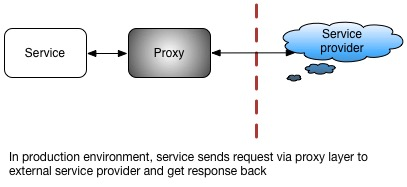
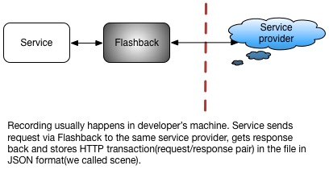
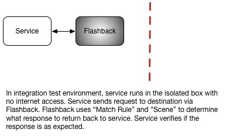

# Flashback
## Introducing Flashback

Flashback is designed to mock HTTP and HTTPS resources, like web services and REST APIs, for testing purposes. It records HTTP/HTTPS requests and plays back a previously recorded HTTP transaction—which we call a "scene"—so that no external connection to the internet is required in order to complete testing.

*Note: The flashback and flashback scene are used for testing purpose only. Each scene contains a list of Http request and response. Those http request and response might contain some sensitive data such as api key, secret, token etc. You'd better either blacklist them using customized match rule or mask them.*

Flashback can also replay scenes based on partial matching of requests. It does so using “match rules.” A match rule associates an incoming request with a previously-recorded request, which is then used to generate a response. For example, the following code snippet implements a basic match rule, where the test method “matches” an incoming request via the URL.

```java
public class MatchSimpleUri implements MatchRule {
  @Override
  public boolean test(RecordedHttpRequest incomingRequest, RecordedHttpRequest expectedRequest) {
    return incomingRequest.getUri().equals(expectedRequest.getUri());
  }

  @Override
  public String getMatchFailureDescriptionForRequests(RecordedHttpRequest incomingRequest, RecordedHttpRequest expectedRequest) {
    return String.format("URI Mismatch%nIncoming URI: %s%nExpected URI: %s%n",
        incomingRequest.getUri(),
        expectedRequest.getUri());
  }
}
```
HTTP requests generally contain a URL, method, headers, and body. Flashback allows match rules to be defined for any combination of these components. Flashback also allows users to add whitelist or blacklist labels to URL query parameters, headers, and the body.

For instance, in an OAuth authorization flow, the request query parameters may look like the following:
```
oauth_consumer_key="jskdjfljsdklfjlsjdfs",
oauth_nonce="ajskldfjalksjdflkajsdlfjasldfja;lsdkj",
oauth_signature="asdfjaklsdjflasjdflkajsdklf",
oauth_signature_method="HMAC-SHA1",
oauth_timestamp="1318622958",
oauth_token="asdjfkasjdlfajsdklfjalsdjfalksdjflajsdlfa",
oauth_version="1.0"
```
Many of these values will change with every request, since OAuth requires clients to generate a new value for oauth_nonce every time. In our testing, we need to verify values of oauth_consumer_key, oauth_signature_method, and oauth_version while also making sure that oauth_nonce, oauth_signature, oauth_timestamp, and oauth_token exist in the request. Flashback gives us the ability to create our own match rules to achieve this goal. This feature lets us test requests with time-varying data, signatures, tokens, etc. without any changes on the client side.

This flexible matching and the ability to function without connecting to the internet are the attributes that separate Flashback from other mocking solutions. Some other notable features include:
* Flashback can generate SSL/TLS certificates on the fly to emulate secured channels for HTTPS requests.
* Flashback is a cross-platform and cross-language solution, with the ability to test both JVM and non-JVM (C++, Python, etc.) apps.

## Terminology
* A Scene stores previously recorded HTTP transactions (in JSON format) that can be later replayed.  
* The Root Path is the file path of the directory that contains the Flashback Scene data.
* A Scene Name is the name of a given scene.
* A Scene Mode is the mode in which the scene is being used—either record or playback.
* A Match Rule is a rule that determines if the incoming client request matches the contents of a given scene.
* Flashback Proxy is an HTTP Proxy with two modes of operation, record and playback.  
* Host and port are the proxy host and port. 

## Introductory Example

### How to Record an HTTP Transaction
Recording an HTTP transaction for later playback, using Flashback, is a relatively straightforward process. In order to record a scene, you must make a real, external request to the destination, and the HTTPS request and response will then be stored in the scene with the match rule that you have specified. When recording, Flashback behaves exactly like a typical “Man in the Middle” (MITM) proxy—it is only in playback mode that the connection flow and data flow are restricted to just between the client and the proxy. 

To see Flashback in action, let us create a scene that captures an interaction with example.org by doing the following:
Step 1: Checkout Flashback source code 

```
git clone https://github.com/linkedin/flashback.git
``` 

Step 2: Start the Flashback admin server 
```
./startAdminServer.sh -port 1234
``` 
Step 3: Start Flashback Proxy:
```
curl "http://localhost:1234/admin?action=startFlashback" --data '{
  "sceneMode": "record",
  "sceneName": "test1",
  "matchRule": "matchEntireRequest",
  "scenePath": "/tmp",
  "proxyHost": "localhost",
  "proxyPort": "5555"
}'
``` 
The Flashback above will be started in record mode on localhost, port 5555. Match rule requires to do exactly match(match both Http body, headers and url). The scene will be stored under /tmp/test1. 

Step 4: Flashback is now ready to record, so use it to proxy a request to example.org: 
```
curl http://www.example.org -x localhost:5555 -X GET
```

Step 5: Flashback can record as many requests as you want. All of those Http transactions will be stored in memory. They won't be dump to file until you shutdown proxy or change scene. Once you finished recording, shutdown Flashback
```
curl "http://localhost:1234/admin?action=shutDownFlashback" --data '{}'
```

Step 6: To verify what has been recorded, we can view the contents of the scene in the output directory (/tmp/test1).  It should contain the following:

```json
{
  "NAME" : "test1",
  "HTTPEXCHANGELIST" : {
    "HTTPEXCHANGE1" : {
      "UPDATETIME" : "8 Mar 2017 23:56:25 GMT",
      "HTTPREQUEST" : {
        "HTTPMETHOD" : "GET",
        "HTTPURI" : "http://www.example.org/",
        "HTTPHEADERS" : {
          "Host" : "www.example.org",
          "User-Agent" : "curl/7.43.0",
          "Accept" : "*/*",
          "Proxy-Connection" : "Keep-Alive"
        },
        "BINARYHTTPBODY" : ""
      },
      "HTTPRESPONSE" : {
        "HTTPSTATUSCODE" : 200,
        "HTTPHEADERS" : {
          "X-Cache" : "HIT",
          "Cache-Control" : "max-age=604800",
          "Etag" : "\"359670651+ident\"",
          "Server" : "ECS (iad/182A)",
          "Vary" : "Accept-Encoding",
          "Expires" : "Wed, 15 Mar 2017 23:56:22 GMT",
          "Last-Modified" : "Fri, 09 Aug 2013 23:54:35 GMT",
          "Content-Length" : "1270",
          "Date" : "Wed, 08 Mar 2017 23:56:22 GMT",
          "Content-Type" : "text/html"
        },
        "STRINGHTTPBODY" : "<!doctype html>\n<html>\n<head>\n    <title>Example Domain</title>\n\n    <meta charset=\"utf-8\" />\n    <meta http-equiv=\"Content-type\" content=\"text/html; charset=utf-8\" />\n    <meta name=\"viewport\" content=\"width=device-width, initial-scale=1\" />\n    <style type=\"text/css\">\n    body {\n        background-color: #f0f0f2;\n        margin: 0;\n        padding: 0;\n        font-family: \"Open Sans\", \"Helvetica Neue\", Helvetica, Arial, sans-serif;\n        \n    }\n    div {\n        width: 600px;\n        margin: 5em auto;\n        padding: 50px;\n        background-color: #fff;\n        border-radius: 1em;\n    }\n    a:link, a:visited {\n        color: #38488f;\n        text-decoration: none;\n    }\n    @media (max-width: 700px) {\n        body {\n            background-color: #fff;\n        }\n        div {\n            width: auto;\n            margin: 0 auto;\n            border-radius: 0;\n            padding: 1em;\n        }\n    }\n    </style>    \n</head>\n\n<body>\n<div>\n    <h1>Example Domain</h1>\n    <p>This domain is established to be used for illustrative examples in documents. You may use this\n    domain in examples without prior coordination or asking for permission.</p>\n    <p><a href=\"http://www.iana.org/domains/example\">More information...</a></p>\n</div>\n</body>\n</html>\n"
      }
    }
  }
}
```

### How to Replay an HTTP Transaction
To replay a previously stored scene, use the same basic setup as is used when recording; the only difference is that you set the “Scene Mode” to “playback” in step 3 above: 
```
curl "http://localhost:1234/admin?action=startFlashback" --data '{
  "sceneMode": "playback",
  "sceneName": "test1",
  "matchRule": "matchEntireRequest",
  "scenePath": "/tmp",
  "proxyHost": "localhost",
  "proxyPort": "5555"
}'
```
One way to verify that the response is from the scene, not the external source, is to disable your internet connectivity temporarily when you go through steps 1 through 6. Another way is to modify your scene file and see if the response is the same as what you have in the file.

### Resources
* [Background](https://github.com/linkedin/flashback/wiki/Background)
* [How to Record and Replay an HTTP Transaction](https://github.com/linkedin/flashback/wiki/How-to-Record-and-Replay-HTTP-Transaction)
* [How to Record and Replay an HTTPS Transaction](https://github.com/linkedin/flashback/wiki/How-to-Record-and-Replay-an-HTTPS-Transaction)
* [Supporting dynamic changes](https://github.com/linkedin/flashback/wiki/Supporting-dynamic-changes)


## Use cases 
At Linkedin, Flashback is mainly used for mocking different Internet providers in integration tests, as illustrated in the diagrams below.  The first diagram shows an internal service inside a Linkedin Production data center interacting with Internet providers (such as Google) via a proxy layer. We want to test this internal service in Testing environment. The second and third diagrams show how we can record and playback scenes in different environments. Recording happens in our Dev environment, where the user starts Flashback on the same port as proxy started. All external requests from the internal service to providers will go through Flashback instead of our proxy layer. After the needed scenes get recorded, we can deploy them to our Test environment. In the Test environment (which is isolated and has no Internet access), Flashback is started on the same port as in the Dev environment. All HTTP requests are still coming from the internal service but the responses will come from Flashback instead of the Internet providers.








## License

Flashback is licensed under the terms of the [BSD-2 Clause license].

## Disclaimer

It is worth noting here that Flashback is intended to be used for testing purpose only. Feel free to integrate Flashback with your service whenever you need it, but note that the record feature of Flashback will need to store everything from the wire, then use it during the replay mode. We recommend that users pay extra attention to ensure that no sensitive member data is being recorded or stored inadvertently. Anything that may violate your company’s data protection or privacy policy is your responsibility. 
